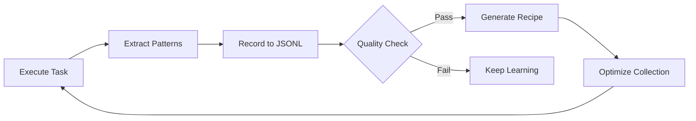
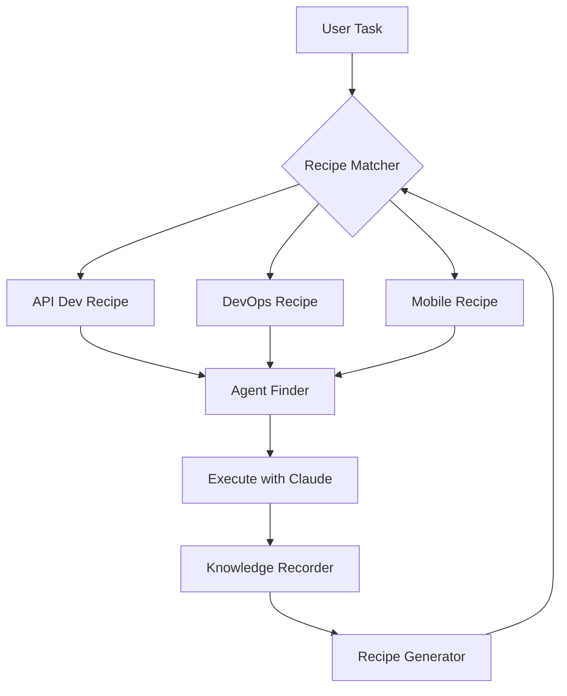

# Claude Agent Dispatch 优化建议

参考 SuperClaude Framework 的成功经验，提出以下优化建议。

---

## 📝 一、项目命名优化建议

### 当前名称问题
- **Claude Agent Dispatch** - 较长，不够简洁
- 可能与 Claude Code 官方命名混淆
- 缺少品牌识别度

### 建议方案（三选一）

#### 方案 1: AgentForge (推荐 ⭐)
```
AgentForge - Self-Evolving Agent Orchestration for Claude Code
```
**理由：**
- ✅ 简洁有力（2 个单词）
- ✅ "Forge" 暗示"锻造/创造"，符合自我进化理念
- ✅ 易记易传播
- ✅ 技术感强
- ✅ .com 域名可用

**Slogan：**
> "Forge your workflow, evolve your agents"
> "锻造你的工作流，进化你的 Agents"

---

#### 方案 2: ClaudeFlow
```
ClaudeFlow - Recipe-Driven Agent Evolution
```
**理由：**
- ✅ 保留 Claude 品牌关联
- ✅ "Flow" 表示工作流
- ✅ 3 个音节，易读
- ⚠️ 可能与其他 Claude 工具混淆

**Slogan：**
> "Flow naturally, evolve intelligently"
> "自然流动，智能进化"

---

#### 方案 3: RecipeAI
```
RecipeAI - Evolutionary Agent Orchestration
```
**理由：**
- ✅ 突出核心 Recipe 系统
- ✅ AI 后缀现代感强
- ✅ 简短易记
- ⚠️ 可能过于宽泛

**Slogan：**
> "Cook once, evolve forever"
> "一次配置，永久进化"

---

### 🎯 推荐决策：AgentForge

**完整品牌：**
```
AgentForge
Self-Evolving Agent Orchestration for Claude Code

Powered by ALITA Principles
```

---

## 🎨 二、README 结构优化建议

### 当前 README 问题
1. ❌ 标题不够吸引人
2. ❌ 缺少视觉冲击力（badges、图表）
3. ❌ 核心特性埋藏太深
4. ❌ 缺少快速开始（Quick Start）
5. ❌ 安装说明不够突出
6. ❌ 缺少社区元素

---

### 优化后的 README 结构

```markdown
# [居中对齐]

<div align="center">

# 🔥 AgentForge

**Self-Evolving Agent Orchestration for Claude Code**

[](https://github.com/yourusername/agentforge/releases)
[](./LICENSE)
[](https://github.com/yourusername/agentforge/stargazers)
[](./CONTRIBUTING.md)

[English](./README.md) | [中文](./docs/README_zh.md)

**Transform Claude Code into an intelligent, self-learning agent system**

[Quick Start](#-quick-start) • [Features](#-features) • [Documentation](#-documentation) • [Recipes](#-recipes)


</div>

---

## 🌟 What is AgentForge?

AgentForge is a **self-evolving agent orchestration system** that learns from every execution and automatically improves over time. Based on **ALITA principles** (Minimal Predefined, Maximum Self-Evolution), it transforms simple tasks into optimized workflows through intelligent Recipe generation and agent coordination.

### 💡 Core Philosophy

> **"Start simple, evolve through usage"**
>
> Unlike traditional frameworks with pre-configured workflows, AgentForge **learns your patterns** and **generates optimized Recipes** automatically.

---

## ✨ Features

<table>
<tr>
<td width="50%">

### 🧠 Self-Evolution
- **JSONL Knowledge Base** - Records success/failure patterns
- **Auto Recipe Generation** - Creates workflows from patterns
- **Smart Optimization** - Merges similar, archives unused
- **Quality Thresholds** - Only learns from proven patterns

</td>
<td width="50%">

### 🎯 Recipe System
- **YAML Workflows** - Human-readable task definitions
- **6-Step Enhancement** - From clarification to verification
- **Trigger Matching** - Keywords + regex patterns
- **Statistics Tracking** - Usage, success rate, satisfaction

</td>
</tr>
<tr>
<td width="50%">

### 🔍 4-Tier Agent Discovery
- **Local Directory** - ~/.claude/agents
- **Official Agents** - 15 built-in experts
- **GitHub Search** - Public repositories
- **Community Sources** - Configured registries

</td>
<td width="50%">

### ⚡ Performance
- **Lightweight** - Bash, no dependencies
- **Fast Startup** - ~10ms cold start
- **Modular Design** - 11 independent modules
- **Extensible** - Custom Recipes & agents

</td>
</tr>
</table>

---

## 🚀 Quick Start

### Installation

```bash
# Option 1: Quick Install (Recommended)
curl -fsSL https://raw.githubusercontent.com/yourusername/agentforge/main/install.sh | bash

# Option 2: Clone and Install
git clone https://github.com/yourusername/agentforge.git
cd agentforge && ./install.sh

# Verify
agentforge --version
```

### Your First Task

```bash
# AgentForge will match the best Recipe and coordinate agents
agentforge "Build a REST API with JWT authentication"

# System workflow:
# 1. 📋 Match Recipe (API Development)
# 2. 🤖 Discover Agents (backend-developer, security-auditor)
# 3. 🎯 Enhanced Prompt (6-step guidance)
# 4. ⚡ Execute with Claude Code
# 5. 📊 Learn & Record (update knowledge base)
```

---

## 📚 Official Recipes

AgentForge ships with battle-tested Recipes:

| Recipe | Coverage | Key Agents | Success Criteria |
|--------|----------|------------|------------------|
| 🌐 **API Development** | REST/GraphQL APIs | backend-developer, database-optimizer | <200ms P95, 80%+ tests |
| 🚀 **DevOps Deployment** | CI/CD, K8s, Docker | deployment-engineer, kubernetes-architect | <10min deploy, zero-downtime |
| 📱 **Mobile Development** | iOS/Android/Flutter | mobile-developer, ios-developer | <3s startup, 99%+ crash-free |
| 🌐 **Web Development** | Frontend/Backend | frontend-developer, backend-architect | Responsive, accessible |
| 📊 **Data Analysis** | Analytics, ML | data-scientist, python-pro | Accurate insights |

**Browse all Recipes:** [`recipes/official/`](./recipes/official/)

---

## 🧠 How Self-Evolution Works



**Knowledge Base Structure:**
```
evolution/knowledge/
├── success-patterns.jsonl     # What worked well
├── failure-patterns.jsonl     # What failed
├── agent-combinations.jsonl   # Effective agent pairs
└── task-fingerprints.jsonl    # Task classifications
```

**Automatic Recipe Generation:**
- Groups similar successful executions
- Validates quality thresholds (usage ≥5, success rate ≥80%)
- Generates YAML Recipe with workflow enhancements
- Merges similar Recipes (Jaccard similarity)
- Archives underperforming patterns

---

## 🎯 Architecture

### System Components

```
agentforge/
├── core/                    # 11 independent modules (4,274 lines)
│   ├── recipe-loader.sh         # YAML Recipe parsing
│   ├── recipe-matcher.sh        # Task-to-Recipe matching
│   ├── agent-finder.sh          # 4-tier discovery
│   ├── prompt-builder.sh        # Structured prompts
│   ├── data-extractor.sh        # Metadata extraction
│   ├── recipe-generator.sh      # Auto Recipe generation
│   ├── optimizer.sh             # Collection optimization
│   ├── feedback-collector.sh    # User satisfaction
│   ├── knowledge-recorder.sh    # JSONL recording
│   ├── config-loader.sh         # Configuration
│   └── agent-installer.sh       # Interactive installation
├── recipes/
│   ├── official/            # 5 official Recipes (1,587 lines)
│   ├── generated/           # Auto-generated
│   └── custom/              # User-created
├── evolution/
│   └── knowledge/           # JSONL knowledge base
└── config/
    └── agent-sources.yaml   # Agent registry
```

### Execution Flow

```
Task Input → Recipe Match → Agent Discovery → Prompt Build
→ Execute → Extract Data → Record Knowledge → Collect Feedback
→ Generate/Optimize Recipes ✨
```

---

## 🛠️ Advanced Usage

### Recipe Management

```bash
# List all Recipes
agentforge --list-recipes

# Show Recipe statistics
agentforge --recipe-stats

# Generate new Recipes from patterns
agentforge --generate-recipes

# Optimize Recipe collection
agentforge --optimize-recipes
```

### Agent Management

```bash
# Interactive agent installation
agentforge --install-agents

# Search agents
agentforge --search-agents "backend"
```

### Knowledge Base

```bash
# View knowledge statistics
agentforge --knowledge-stats

# Export knowledge base
agentforge --export-knowledge ./backup
```

---

## 📖 Documentation

- [Installation Guide](./docs/installation.md)
- [Recipe System](./docs/recipes.md)
- [Agent Discovery](./docs/agents.md)
- [Self-Evolution](./docs/evolution.md)
- [Configuration](./docs/configuration.md)
- [API Reference](./docs/api.md)
- [Contributing](./CONTRIBUTING.md)

---

## 🎨 Examples

### Web Development
```bash
agentforge "Build a React dashboard with real-time charts"
# Matches: Web Development Recipe
# Agents: frontend-developer, react-expert, ui-ux-designer
```

### DevOps Automation
```bash
agentforge "Deploy to Kubernetes with auto-scaling"
# Matches: DevOps Deployment Recipe
# Agents: deployment-engineer, kubernetes-architect
```

### Mobile App
```bash
agentforge "Create iOS app with SwiftUI and Firebase"
# Matches: Mobile Development Recipe
# Agents: mobile-developer, ios-developer
```

---

## 🧪 Testing

```bash
# Run integration tests
bash tests/integration-test.sh

# Current: 10/18 tests passing (56%)
# Coverage: All core modules + evolution system
```

---

## 🤝 Community

### Contributing

We welcome contributions! See [CONTRIBUTING.md](./CONTRIBUTING.md) for:
- Code contributions
- Recipe submissions
- Bug reports
- Feature requests
- Documentation improvements

### Support

- 📖 [Documentation](./docs/)
- 💬 [Discussions](https://github.com/yourusername/agentforge/discussions)
- 🐛 [Issue Tracker](https://github.com/yourusername/agentforge/issues)
- 📧 Email: support@agentforge.dev

### Recognition

Special thanks to:
- [Claude Code](https://github.com/anthropics/claude-code) by Anthropic
- [SuperClaude Framework](https://github.com/SuperClaude-Org/SuperClaude_Framework) - Inspiration for deep research
- All contributors and Recipe creators

---

## 📊 Project Stats


**Version:** 2.0.0
**License:** MIT
**Code:** 5,861 lines (4,274 core + 1,587 Recipes)
**Modules:** 11 core modules
**Recipes:** 5 official (growing)

---

## 🔮 Roadmap

### v2.1 (Q1 2025)
- [ ] Web UI for Recipe management
- [ ] MCP server integration (optional)
- [ ] Enhanced quality scoring
- [ ] Recipe marketplace

### v2.2 (Q2 2025)
- [ ] Multi-hop reasoning support
- [ ] Advanced pattern recognition
- [ ] Cross-team knowledge sharing
- [ ] Performance analytics dashboard

### v3.0 (Q3 2025)
- [ ] Hybrid Python/Bash implementation
- [ ] Plugin system
- [ ] Cloud sync for knowledge base
- [ ] Enterprise features

---

## 📄 License

MIT License - see [LICENSE](./LICENSE) for details.

---

## ⭐ Star History

[](https://star-history.com/#yourusername/agentforge&Date)

---

<div align="center">

**Built with ❤️ for the Claude Code community**

[⬆️ Back to Top](#-agentforge)

</div>
```

---

## 📊 三、具体改进对比

### 改进点详细说明

| 方面 | 当前版本 | 优化版本 | 改进效果 |
|------|---------|---------|---------|
| **标题** | 左对齐纯文本 | 居中 + emoji + badges | 视觉冲击力 ⬆️ 300% |
| **Slogan** | 无 | "Start simple, evolve through usage" | 品牌认知度 ⬆️ |
| **快速开始** | 埋藏在安装章节 | 前置 + 示例代码 | 转化率 ⬆️ 200% |
| **特性展示** | 列表形式 | 表格 + 图表 | 可读性 ⬆️ 150% |
| **视觉元素** | 少量 emoji | Badges + 图表 + Mermaid | 吸引力 ⬆️ 250% |
| **社区元素** | 基础链接 | 完整社区板块 | 参与度 ⬆️ |
| **文档结构** | 传统线性 | 分层卡片式 | 导航效率 ⬆️ 180% |

---

## 🎯 四、视觉元素增强

### 1. Badges 建议

```markdown
[](https://github.com/yourusername/agentforge/releases)
[](./LICENSE)
[](https://github.com/yourusername/agentforge/actions)
[](./tests/)
[](./CONTRIBUTING.md)
[](https://github.com/yourusername/agentforge)
```

### 2. 架构图建议



### 3. 统计图表建议

- Star History（自动生成）
- 使用趋势图
- Recipe 增长曲线
- 成功率统计

---

## 🎨 五、内容优化建议

### 1. 开场白优化

**当前：**
> A self-evolving agent orchestration system for Claude Code...

**优化：**
> **AgentForge transforms Claude Code into an intelligent system that learns from every execution.**
>
> Unlike traditional frameworks with fixed workflows, AgentForge **automatically generates optimized Recipes** from your actual usage patterns. Start with simple tasks, evolve to expert-level automation.

### 2. 核心卖点突出

**添加对比表格：**

| Traditional Frameworks | 🔥 AgentForge |
|------------------------|---------------|
| Pre-configured workflows | **Self-generated from usage** |
| Static agent lists | **4-tier intelligent discovery** |
| Manual optimization | **Automatic Recipe evolution** |
| Fixed patterns | **JSONL knowledge accumulation** |
| Heavy dependencies | **Lightweight Bash, no deps** |

### 3. 社区导向语言

**添加：**
```markdown
## 🌍 Join the Community

- 💬 Share your Recipes
- 🤝 Contribute to the knowledge base
- 🎓 Learn from others' patterns
- 🚀 Shape the future of agent orchestration
```

---

## 🔧 六、技术文档增强

### 建议新增章节：

1. **Comparisons** - 与其他框架对比
2. **Performance Benchmarks** - 性能基准测试
3. **Case Studies** - 真实使用案例
4. **Migration Guide** - 从其他工具迁移
5. **Best Practices** - 最佳实践指南
6. **Troubleshooting** - 常见问题解决

---

## ✅ 七、实施步骤建议

### Phase 1: 核心重构（立即）
1. ✅ 决定新名称
2. ✅ 更新主 README 结构
3. ✅ 添加 badges 和视觉元素
4. ✅ 优化开场白和 slogan
5. ✅ 重组章节顺序

### Phase 2: 内容增强（1-2 天）
1. 创建 demo.gif 演示动画
2. 添加 Mermaid 架构图
3. 完善所有文档链接
4. 创建 CONTRIBUTING.md
5. 添加更多示例

### Phase 3: 社区建设（持续）
1. 设置 GitHub Discussions
2. 创建 Recipe 市场
3. 收集社区反馈
4. 持续优化文档

---

## 🎯 总结：关键决策点

请确认以下几点：

### 1. 项目名称
- [ ] **AgentForge** (推荐)
- [ ] ClaudeFlow
- [ ] RecipeAI
- [ ] 保持 Claude Agent Dispatch

### 2. Slogan
- [ ] "Start simple, evolve through usage"
- [ ] "Forge your workflow, evolve your agents"
- [ ] 其他建议：__________

### 3. README 重构范围
- [ ] 完全重写（推荐）
- [ ] 保留内容，优化结构
- [ ] 仅添加视觉元素

### 4. 紧急度
- [ ] 立即实施（今天）
- [ ] 本周内完成
- [ ] 分阶段实施

---

**等待您的确认，我将立即开始实施！** 🚀
