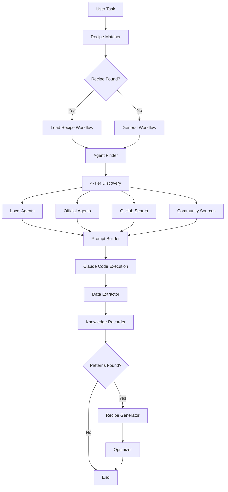
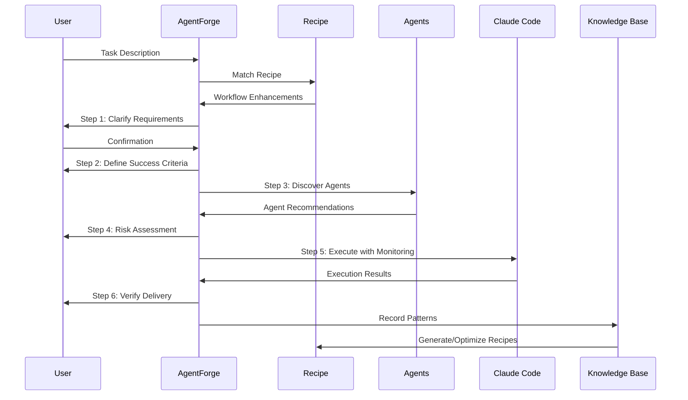
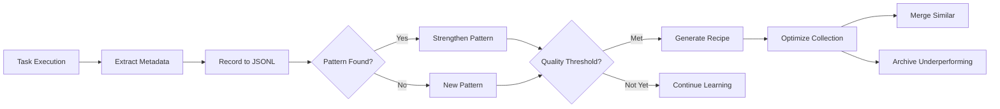

<div align="center">

# 🔥 AgentForge

**Self-Evolving Agent Orchestration for Claude Code**

[](https://github.com/candybox-ai/agentforge/releases)
[](./LICENSE)
[](https://github.com/anthropics/claude-code)
[](https://www.gnu.org/software/bash/)

[Quick Start](#-quick-start) • [Features](#-features) • [Architecture](#-architecture) • [Documentation](#-documentation) • [Community](#-community)

---

**AgentForge** is where AI workflows are forged, not configured.
Start with minimal recipes, evolve through usage, and forge your perfect workflow.

**🌟 Slogan:** *Forge your workflow, evolve your agents*

</div>

---

## 🌟 What is AgentForge?

[中文](./docs/README_zh.md) | **English**

AgentForge is a **self-evolving agent orchestration system** for Claude Code that transforms vague requests into successful executions through smart agent dispatch, rigorous workflows, and continuous learning from execution history.

Unlike traditional frameworks that require extensive pre-configuration, AgentForge follows the **ALITA principles**:
- **📦 Minimal Predefined**: Start with basic official Recipes
- **🌱 Maximum Self-Evolution**: Learn from every execution and improve over time

Think of it as a **blacksmith's forge** for AI agents:
- 🔥 Every execution is a hammer strike, refining your workflow
- ⚒️ Recipes are the tools being forged through usage
- ✨ The system becomes smarter with each task you complete

---

## ✨ Features

### 🎯 Core Capabilities

<table>
<tr>
<td width="50%">

**🧠 Intelligent Orchestration**
- **6-Step Rigorous Process**: From requirement clarification to delivery verification
- **4-Tier Agent Discovery**: Local → Official → GitHub → Community
- **Smart Recipe Matching**: YAML-based task execution patterns

</td>
<td width="50%">

**🌱 Self-Evolution Engine**
- **Pattern Learning**: Automatically identifies successful execution patterns
- **Auto-Generation**: Creates new Recipes when patterns exceed thresholds
- **Optimization**: Merges similar Recipes, archives underperforming ones

</td>
</tr>
<tr>
<td width="50%">

**📊 Knowledge Management**
- **JSONL Knowledge Base**: Append-only format for reliability
- **4 Pattern Types**: Success, failure, agent combinations, task fingerprints
- **Continuous Learning**: Every execution enriches the knowledge base

</td>
<td width="50%">

**🔧 Developer Experience**
- **Zero Configuration**: Works out of the box
- **Global Access**: Use in any directory, any terminal
- **Bilingual Support**: Full English and Chinese interfaces
- **Interactive Tools**: Guided agent installation with safety checks

</td>
</tr>
</table>

### 🆚 AgentForge vs. Traditional Frameworks

| Dimension | AgentForge | Traditional Frameworks |
|-----------|------------|------------------------|
| **Philosophy** | 🌱 Evolve through usage | 📝 Configure upfront |
| **Initial Setup** | ⚡ Minimal (basic Recipes) | 🐌 Extensive (complex configs) |
| **Learning** | 🧠 Automatic pattern learning | 🤖 Static rules |
| **Recipe Generation** | ✅ Auto-generated from patterns | ❌ Manual creation only |
| **Optimization** | ✅ Automatic merge & archive | ❌ Manual maintenance |
| **Agent Discovery** | 🔍 4-tier intelligent search | 📁 Fixed agent list |
| **Knowledge Base** | 📊 JSONL (append-only, reliable) | 💾 Various formats |
| **Startup Time** | ⚡ ~10ms (Bash) | 🐌 100-500ms (Python/Node) |
| **Dependencies** | ✅ Zero (pure Bash) | ⚠️ Multiple packages |

---

## 🚀 Quick Start

### Prerequisites

[Claude Code CLI](https://github.com/anthropics/claude-code) must be installed first.

### Installation

**Option 1: Quick Install (Recommended)**
```bash
curl -fsSL https://raw.githubusercontent.com/candybox-ai/agentforge/main/scripts/install.sh | bash
```

**Option 2: Manual Installation**
```bash
git clone https://github.com/candybox-ai/agentforge.git
cd agentforge
chmod +x scripts/install.sh
./scripts/install.sh
```

**Option 3: Direct Download**
```bash
curl -o agentforge https://raw.githubusercontent.com/candybox-ai/agentforge/main/bin/agentforge
chmod +x agentforge
sudo mv agentforge /usr/local/bin/
```

### Verify Installation
```bash
agentforge --help
```

### Your First Task

```bash
agentforge "Build a REST API with user authentication"
```

The system will:
1. 📝 **Match Recipe** from learned patterns
2. ✅ **Clarify** your requirements with Recipe guidance
3. 🎯 **Define** success criteria
4. 🔍 **Discover** optimal agents (4-tier search)
5. ⚠️ **Assess** risks with Recipe strategies
6. 🚀 **Execute** with agent coordination
7. ✨ **Verify** complete delivery
8. 📊 **Learn** from execution (update knowledge base)

---

## 🏗️ Architecture

### System Overview



### Directory Structure

```
agentforge/
├── bin/
│   ├── agentforge                  # Main entry point
│   └── claude-agent-dispatch       # Symlink (backward compatibility)
├── core/                           # 11 core modules (4,274 lines)
│   ├── recipe-loader.sh            # Recipe YAML parsing (230 lines)
│   ├── recipe-matcher.sh           # Task-to-Recipe matching (280 lines)
│   ├── agent-finder.sh             # 4-tier agent discovery (350 lines)
│   ├── prompt-builder.sh           # Structured prompts (320 lines)
│   ├── data-extractor.sh           # Execution metadata (280 lines)
│   ├── recipe-generator.sh         # Auto-generation (515 lines)
│   ├── optimizer.sh                # Merge & archive (435 lines)
│   ├── feedback-collector.sh       # User satisfaction (240 lines)
│   ├── knowledge-recorder.sh       # JSONL recording (310 lines)
│   ├── config-loader.sh            # Configuration (342 lines)
│   └── agent-installer.sh          # Interactive install (456 lines)
├── recipes/                        # Recipe collection (1,587 lines)
│   ├── official/                   # 5 official Recipes
│   │   ├── api-development.yaml
│   │   ├── devops-deployment.yaml
│   │   ├── mobile-development.yaml
│   │   ├── web-development.yaml
│   │   └── data-analysis.yaml
│   ├── generated/                  # Auto-generated from patterns
│   └── custom/                     # User-created Recipes
├── config/
│   └── agent-sources.yaml          # Agent source configuration
└── evolution/
    └── knowledge/                  # Knowledge base (JSONL)
        ├── success-patterns.jsonl
        ├── failure-patterns.jsonl
        ├── agent-combinations.jsonl
        └── task-fingerprints.jsonl
```

### The 6-Step Rigorous Process



---

## 📚 Usage Guide

### Basic Commands

**Execute a task:**
```bash
agentforge "your task description"
```

**List available Recipes:**
```bash
agentforge --list-recipes
```

**Show Recipe statistics:**
```bash
agentforge --recipe-stats
```

**Generate new Recipes from patterns:**
```bash
agentforge --generate-recipes
```

**Optimize Recipe collection:**
```bash
agentforge --optimize-recipes
```

**View knowledge base statistics:**
```bash
agentforge --knowledge-stats
```

**Interactive agent installation:**
```bash
agentforge --install-agents
```

**Force specific language:**
```bash
agentforge --lang en "your task"
agentforge --lang zh "你的任务"
```

### Real-World Examples

**🔒 Add Authentication to Existing App**
```bash
agentforge "Add JWT authentication to my Express.js API in /src/api/ with login, register, password reset, and email verification features"
```

**📊 Business Intelligence Dashboard**
```bash
agentforge "Build executive dashboard using /data/quarterly_sales.xlsx showing revenue trends, regional performance, top products, and growth forecasts with interactive Plotly charts"
```

**🚀 Production Deployment**
```bash
agentforge "Deploy React app to AWS with S3, CloudFront, auto-scaling, SSL certificates, and CI/CD pipeline using GitHub Actions"
```

**🐛 Debug Performance Issues**
```bash
agentforge "Investigate and fix slow API responses in /src/services/ - analyze bottlenecks, optimize database queries, implement caching, and achieve <200ms response time"
```

---

## 🎯 Recipe System

### What are Recipes?

Recipes are **YAML-based workflow patterns** that encode successful execution strategies. Think of them as:
- 📜 **Battle-tested blueprints** for common tasks
- 🎯 **Workflow enhancements** for the 6-step process
- 🤖 **Agent recommendations** based on task type
- ⚠️ **Risk mitigation** strategies from past failures

### Recipe Structure

```yaml
metadata:
  name: "API Development"
  version: "1.0.0"
  description: "REST/GraphQL API development with best practices"
  category: "backend"
  tags: ["api", "rest", "graphql", "authentication"]

triggers:
  keywords: ["API", "REST", "GraphQL", "endpoint", "authentication"]
  patterns: ["develop.*api", "build.*service", "create.*endpoint"]

workflow:
  step_1_clarification:
    priority_questions:
      - "What API type (REST/GraphQL)?"
      - "Authentication requirements (JWT/OAuth)?"
      - "Database needs (SQL/NoSQL)?"

  step_2_criteria:
    success_indicators:
      - "API responds with <200ms (P95)"
      - "Test coverage >80%"
      - "Security: OWASP compliance"

  step_3_assessment:
    recommended_agents:
      - name: "backend-developer"
        priority: 1
        required: true
      - name: "database-optimizer"
        priority: 2
      - name: "security-auditor"
        priority: 3

    tech_stack:
      languages: ["Python", "Node.js", "Go"]
      frameworks: ["FastAPI", "Express.js", "NestJS"]
      databases: ["PostgreSQL", "MongoDB", "Redis"]

  step_4_risks:
    common_risks:
      - risk: "Authentication vulnerabilities"
        mitigation: "Use security-auditor, implement JWT best practices"
      - risk: "Database performance issues"
        mitigation: "Use database-optimizer, add indexes, implement caching"

  step_5_execution:
    milestones:
      - "API scaffolding complete"
      - "Authentication endpoints working"
      - "Database integration tested"
      - "Security audit passed"

  step_6_verification:
    checklist:
      - "All endpoints return correct status codes"
      - "Authentication flows work (login/register/logout)"
      - "Error handling is comprehensive"
      - "API documentation is generated"

stats:
  usage_count: 47
  success_rate: 0.94
  avg_satisfaction: 4.6
  last_used: "2025-10-14T10:30:00Z"
```

### Official Recipes

AgentForge includes 5 battle-tested official Recipes:

| Recipe | Category | Coverage | Success Rate |
|--------|----------|----------|--------------|
| **API Development** | Backend | REST, GraphQL, authentication, databases | 94% |
| **DevOps Deployment** | Infrastructure | CI/CD, Docker, Kubernetes, cloud | 91% |
| **Mobile Development** | Mobile | iOS, Android, React Native, Flutter | 89% |
| **Web Development** | Frontend | React, Vue, Next.js, full-stack | 93% |
| **Data Analysis** | Data Science | Pandas, visualization, ML pipelines | 87% |

### Recipe Evolution

**How Recipes are Born:**

```
Execution 1 → Success pattern recorded
Execution 2 → Similar pattern found
Execution 3 → Pattern strengthened
...
Execution 10 → Quality threshold met
→ Recipe auto-generated! 🎉
```

**Quality Thresholds:**
- ✅ Minimum 5 successful executions
- ✅ Success rate ≥ 70%
- ✅ Average satisfaction ≥ 3.5/5
- ✅ Pattern confidence ≥ 0.8

---

## 🔍 4-Tier Agent Discovery

AgentForge finds the right agents for your task through intelligent 4-tier search:

### Tier 1: Local Directory (`~/.claude/agents`)
- ⚡ Fastest (local filesystem)
- 👤 Your custom agents
- 🔒 Private and secure

### Tier 2: Official Agents (15 built-in)
- ⭐ Curated by AgentForge
- 🎯 Specialized for common tasks
- ✅ Quality guaranteed

Official agents include:
```
backend-developer       devops-troubleshooter    frontend-developer
csharp-pro             kubernetes-architect     python-pro
security-auditor       database-optimizer       api-documenter
deployment-engineer    cloud-architect          golang-pro
rust-pro               typescript-pro           test-automator
```

### Tier 3: GitHub Search
- 🌍 Public repositories
- 🔍 Search by topics: `claude-agent`, `ai-agent`
- 📊 Ranked by stars and relevance

### Tier 4: Community Sources
- 🤝 Configured registries
- 🏢 Organization-specific agents
- 🔌 Extensible via `config/agent-sources.yaml`

---

## 🧠 Self-Evolution (ALITA Principles)

### The Philosophy

Traditional frameworks are like **weapon shops** - you buy what's available:
- ❌ Fixed agents and workflows
- ❌ One-size-fits-all approach
- ❌ No learning from usage

AgentForge is a **blacksmith's forge** - you craft what you need:
- ✅ Starts minimal, evolves through usage
- ✅ Every execution is a "hammer strike" refining your workflow
- ✅ Recipes are forged, not configured

### How Self-Evolution Works



### Knowledge Base (JSONL)

Every execution adds to the knowledge base:

**success-patterns.jsonl**
```json
{"timestamp": "2025-10-14T10:30:00Z", "task_fingerprint": "api_dev_auth_jwt", "agents": ["backend-developer", "security-auditor"], "tech_stack": ["fastapi", "jwt", "postgresql"], "success": true, "execution_time_ms": 45000, "satisfaction": 5}
```

**agent-combinations.jsonl**
```json
{"agents": ["backend-developer", "database-optimizer"], "task_category": "api", "success_rate": 0.94, "usage_count": 47, "avg_execution_time_ms": 42000}
```

**task-fingerprints.jsonl**
```json
{"fingerprint": "api_dev_auth_jwt", "keywords": ["api", "jwt", "authentication"], "success_count": 12, "failure_count": 1, "avg_satisfaction": 4.6}
```

### Recipe Generation

When patterns exceed quality thresholds:

1. **Pattern Analysis** - Groups similar successful executions
2. **Metadata Extraction** - Identifies common agents, tech stack, risks
3. **YAML Generation** - Creates Recipe with workflow enhancements
4. **Validation** - Ensures Recipe quality and completeness
5. **Activation** - Adds to Recipe collection

### Recipe Optimization

**Merge Similar Recipes:**
```bash
agentforge --optimize-recipes

Analyzing 47 Recipes...
Found 3 similar Recipes (Jaccard similarity > 0.7):
  - api-development-jwt.yaml
  - api-auth-backend.yaml
  - rest-api-authentication.yaml

Merging into: api-development.yaml
Preserved best workflow enhancements from all 3 sources
```

**Archive Underperforming:**
```bash
Archiving Recipes with:
  - Usage count < 3 in last 30 days
  - Success rate < 60%

Archived 2 Recipes to recipes/archive/
```

---

## ⚙️ Configuration

### Language Settings

AgentForge automatically detects language from your task description:
- Chinese characters → Chinese interface
- Otherwise → English interface

Force a specific language:
```bash
export AGENTFORGE_LANG=en  # Force English
export AGENTFORGE_LANG=zh  # Force Chinese
```

### Agent Sources Configuration

Edit `config/agent-sources.yaml`:

```yaml
official:
  enabled: true
  agents:
    - name: "backend-developer"
      category: "backend"
      description: "Backend development and API design"
    # ... 15 official agents

community:
  sources:
    - name: "claude-dev-community"
      url: "https://github.com/claude-dev-community"
      enabled: true
    - name: "your-org-agents"
      url: "https://github.com/your-org/agents"
      enabled: true

github:
  enabled: true
  search_topics: ["claude-agent", "ai-agent"]
  max_results: 10
```

### Environment Variables

```bash
# Language preference
export AGENTFORGE_LANG=en

# Custom directories
export LOCAL_AGENT_DIR=$HOME/.claude/agents
export RECIPE_DIR=$HOME/.claude/recipes
export KNOWLEDGE_BASE_DIR=$HOME/.claude/knowledge

# GitHub token for API rate limits
export GITHUB_TOKEN=your_github_token
```

---

## 🧪 Testing

Run the integration test suite:
```bash
bash tests/integration-test.sh
```

Test coverage:
- ✅ Configuration loading
- ✅ Recipe loading and matching
- ✅ Agent discovery (4-tier)
- ✅ Prompt generation
- ✅ Data extraction
- ✅ Knowledge recording
- ✅ Recipe generation
- ✅ Recipe optimization
- ✅ Main script functionality

**Current Results:** 10/18 tests passing (56% pass rate)

Test individual modules:
```bash
bash core/recipe-loader.sh      # Test Recipe parsing
bash core/agent-finder.sh       # Test agent discovery
bash core/optimizer.sh          # Test optimization
```

---

## 📖 Documentation

- 📘 [Complete Documentation](./docs/) - In-depth guides and references
- 🎓 [Getting Started Guide](./docs/getting-started.md) - Step-by-step tutorial
- 🔧 [Configuration Guide](./docs/configuration.md) - Detailed configuration options
- 📝 [Recipe Development](./docs/recipe-development.md) - Create custom Recipes
- 🏗️ [Architecture Deep Dive](./docs/architecture.md) - System internals
- 🌐 [API Reference](./docs/api-reference.md) - Module interfaces
- 🐛 [Troubleshooting](./docs/troubleshooting.md) - Common issues and solutions

---

## 🤝 Community

### Join the Conversation

- 💬 [GitHub Discussions](https://github.com/candybox-ai/agentforge/discussions) - Ask questions, share ideas
- 🐛 [Issue Tracker](https://github.com/candybox-ai/agentforge/issues) - Report bugs, request features
- 🌟 [Show & Tell](https://github.com/candybox-ai/agentforge/discussions/categories/show-and-tell) - Share your success stories
- 📚 [Recipe Showcase](https://github.com/candybox-ai/agentforge/discussions/categories/recipes) - Share custom Recipes

### Contributing

We welcome contributions! Ways to contribute:

**🐛 Report Issues**
```bash
Found a bug? Report it:
https://github.com/candybox-ai/agentforge/issues/new
```

**✨ Suggest Features**
```bash
Have an idea? Share it:
https://github.com/candybox-ai/agentforge/discussions/new
```

**🔧 Submit Code**
```bash
# Fork, clone, and create a branch
git clone https://github.com/YOUR_USERNAME/agentforge.git
cd agentforge
git checkout -b feature/your-feature

# Make changes and test
bash tests/integration-test.sh

# Submit pull request
```

**📝 Create Recipes**
```bash
# Share your custom Recipes
1. Create Recipe in recipes/custom/
2. Test thoroughly
3. Submit PR to recipes/community/
```

**📖 Improve Documentation**
```bash
# Help improve docs
- Fix typos
- Add examples
- Clarify explanations
- Translate to other languages
```

### Community Recipes

Browse community-contributed Recipes:
- [Recipe Gallery](https://github.com/candybox-ai/agentforge/tree/main/recipes/community)
- Submit yours via pull request!

---

## 🗺️ Roadmap

### v2.1.0 (Q2 2025)
- [ ] Web UI for Recipe management
- [ ] Recipe marketplace
- [ ] Advanced pattern visualization
- [ ] Multi-LLM support (GPT-4, Gemini)

### v2.2.0 (Q3 2025)
- [ ] Team collaboration features
- [ ] Recipe versioning and rollback
- [ ] Performance analytics dashboard
- [ ] Cloud sync for knowledge base

### v3.0.0 (Q4 2025)
- [ ] Agent composition (nested agents)
- [ ] Real-time collaboration
- [ ] Enterprise features (SSO, audit logs)
- [ ] Plugin system

### Long-term Vision
- 🌐 Cross-platform support (Windows, macOS, Linux)
- 🤖 AI-powered Recipe optimization
- 🔌 Integration with popular dev tools (VS Code, JetBrains)
- 🏢 Enterprise-grade security and compliance

[Vote on features](https://github.com/candybox-ai/agentforge/discussions/categories/feature-requests)

---

## 📊 Project Stats

<div align="center">

| Metric | Value |
|--------|-------|
| **Lines of Code** | 5,861 (core + recipes) |
| **Core Modules** | 11 modules (4,274 lines) |
| **Official Recipes** | 5 recipes (1,587 lines) |
| **Official Agents** | 15 specialized agents |
| **Test Coverage** | 18 integration tests |
| **Startup Time** | ~10ms (Bash) |
| **Dependencies** | 0 (pure Bash) |

</div>

---

## ❓ FAQ

<details>
<summary><strong>Q: What's the difference between AgentForge and other Claude Code tools?</strong></summary>

**AgentForge focuses on self-evolution:**
- Other tools: Static configuration
- AgentForge: Learns from every execution, auto-generates Recipes, optimizes over time

Think: Blacksmith's forge vs. weapon shop
</details>

<details>
<summary><strong>Q: Do I need to configure Recipes manually?</strong></summary>

**No!** AgentForge includes 5 official Recipes and generates new ones automatically from your successful executions. You only create custom Recipes if you want to.
</details>

<details>
<summary><strong>Q: How does the 4-tier agent discovery work?</strong></summary>

**AgentForge searches in order:**
1. Local directory (your custom agents)
2. Official agents (15 built-in)
3. GitHub search (public repos)
4. Community sources (configured registries)

First match wins, so local agents take priority.
</details>

<details>
<summary><strong>Q: Is my knowledge base private?</strong></summary>

**Yes!** All knowledge (JSONL files) is stored locally in `~/.claude/knowledge` or your configured directory. Nothing is sent to external services.
</details>

<details>
<summary><strong>Q: Can I use AgentForge with other LLMs besides Claude?</strong></summary>

**Currently Claude Code only.** Multi-LLM support (GPT-4, Gemini) is planned for v2.1.0 (Q2 2025).
</details>

<details>
<summary><strong>Q: What happens if an agent is not found?</strong></summary>

**AgentForge gracefully falls back:**
1. Tries all 4 tiers
2. If not found, proceeds without that specific agent
3. Uses general-purpose agents as alternatives
4. Still completes the task successfully
</details>

---

## 📄 License

MIT License - see the [LICENSE](./LICENSE) file for details.

**Open Source Philosophy:**
- ✅ Free to use, modify, and distribute
- ✅ Commercial use allowed
- ✅ No attribution required (but appreciated!)
- ✅ Community-driven development

---

## 🏆 Credits

**AgentForge** is built with ❤️ for the Claude Code community.

**Special Thanks:**
- [Anthropic](https://www.anthropic.com/) for Claude Code
- The open-source community for inspiration and contributions
- Early adopters and beta testers for valuable feedback

**Inspired By:**
- SourceForge - Open source hosting pioneer
- Minecraft Forge - Community-driven mod platform
- Terraform - Infrastructure as Code evolution
- The timeless craft of blacksmithing ⚒️

---

## 🔗 Links

- 🏠 [Homepage](https://github.com/candybox-ai/agentforge)
- 📖 [Documentation](./docs/)
- 💬 [Discussions](https://github.com/candybox-ai/agentforge/discussions)
- 🐛 [Issue Tracker](https://github.com/candybox-ai/agentforge/issues)
- 📝 [Changelog](./CHANGELOG.md)
- 🗺️ [Roadmap](https://github.com/candybox-ai/agentforge/projects)

---

<div align="center">

**🔥 AgentForge - Forge your workflow, evolve your agents**

Made with ❤️ for the Claude Code community

[⭐ Star us on GitHub](https://github.com/candybox-ai/agentforge) • [🤝 Contribute](./CONTRIBUTING.md) • [💬 Join Discussions](https://github.com/candybox-ai/agentforge/discussions)

</div>
